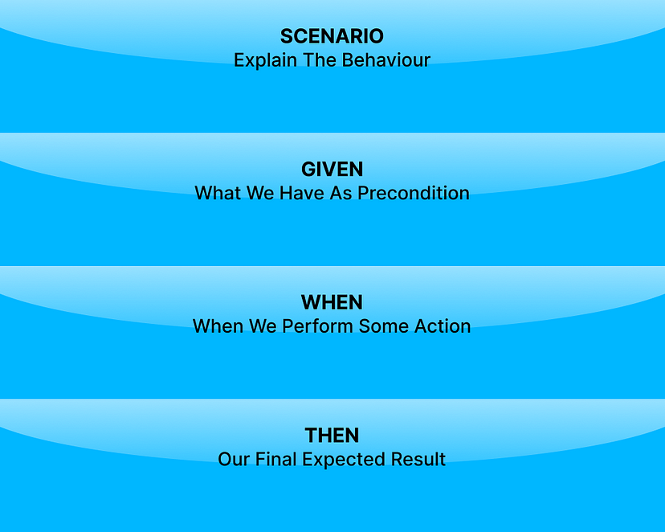
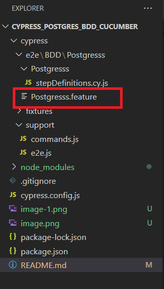
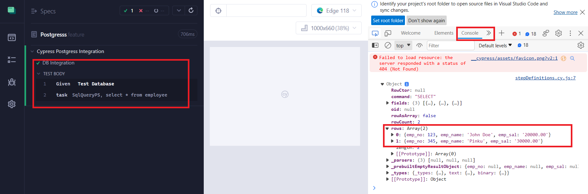

# Cypress_Postgres_BDD_Cucumber

we will focus on version 13.1.0 of Cypress and demonstrate how to integrate it with Cucumber, as well as how to use the Page Object Model (POM) in conjunction with Cucumber for efficient test automation.

# Overview
Cucumber is a well-known Behavior-Driven Development (BDD) framework that lets developers implement (or perform) end-to-end testing. The Cucumber framework is fundamentally designed to assist developers in writing acceptance test cases that are easily understood by any user accessing the software.

Test cases are written based on the behavior of the application’s functions. They are written in a language that is easily understood by normal users. This framework feature makes it a popular BDD testing tool connecting the gap between the product owners and the developers.

Another reason the framework is so popular as a BDD testing tool is that the framework uses a language called Gherkin. Gherkin is the language used by Cucumber developers to define tests. Since it is written in plain English, it is easy to understand even for a non-technical user.

The combination of Cypress and Cucumber provides a robust framework that permits you to form purposeful tests in a simple method.

# What is BDD?

Behavior-Driven Development (BDD) is a development approach that promotes communication between team members. This collaborative approach brings together the business and technical aspects of projects. BDD simulates how an application should behave from the end user’s perspective. The main goal of implementing BDD testing is to improve collaboration between developers, QA, DevOps, PO, BA, and other stakeholders.

BDD enables teams to communicate requirements better, detect problems early, and easily maintain software over time. The first is to make sure the entire team understands the requirements. Then teams can focus on preventing potential problems rather than fighting fires if they are found later. BDD ensures that everyone is in the loop from the beginning and throughout the process, which helps effective and quality communication between team members.

# What is Cucumber?

Cucumber is an open-source framework that supports BDD. Cucumber supports the Gherkin language, and in Gherkin, we can write our use cases in plain English that the tool reads easily. Cucumber reads the test written in Gherkin and verifies that the code works as it should. It does this by working on Gherkin scenarios and steps. Once all test cases are executed, a Cucumber report is generated with each step and scenario with pass and fail results.

# What is Gherkin?

Gherkin is a simple, structured language used in Cucumber for writing executable specifications of software behavior.
It’s designed to be easily readable by both technical and non-technical team members.
Gherkin uses a specific syntax with keywords like Given, When, Then, And, and But to describe scenarios and steps in a test.
Gherkin scenarios are often written in plain text and describe the expected behavior of a feature in a user-friendly way.

# Here’s a simple example of a Gherkin scenario for testing the login functionality of a website:

        Feature: User Login

    Scenario: Valid user login
        Given the user is on the login page
        When the user enters valid credentials
        And clicks the login button
        Then they should be logged into their account

In this example, Gherkin is used to define the steps that need to be taken for testing the login feature. Cucumber can then execute these steps and verify whether the behavior matches the expected outcome.

Use of Gherkin language used in writing the story by POs, BA’s makes stories more focused and easy to understand for the technical and non-technical side. Also, it becomes very easy for QA people to write their automation script because now requirements are more clear compared to when we are not using Cucumber with Gherkin syntax.

Syntax of Writing the Feature File
First, you have to explain the feature that we want to implement, usually in the classic form of a user story: As a <person>, I Want <feature>, For <Business Value>.

Then you can define one or more business scenarios, meaning the overall behavior you want to receive with the user story.

# Installing Cypress

Below are the steps to install Cypress. However, you can go through this blog to get started with Cypress testing.

## Step 1: Create a folder and Generate package.json.

Create a project, naming it cypress_Cucumber_BDD.
Use the npm init command to create a package.json file.

## Step 2: Run the below command to install Cypress.

In the project folder, run > npm install — save-dev cypress@13.1.0
We can see below after installation that Cypress version 13.1.0 is reflected below. The latest version of Cypress is 13.2.0

        {
            "name": "cypress_postgres_bdd_cucumber",
            "version": "1.0.0",
            "description": "",
            "main": "index.js",
            "scripts": {
                "test": "echo \"Error: no test specified\" && exit 1"
                },
            "author": "Sudheer Baraker",
            "license": "ISC",
            "devDependencies": {
            "cypress": "^13.1.0"
            }
        }

## Step 3: Create a folder under the Integration folder.

Set up Cucumber and create a feature file?
In this section of this Cypress Cucumber tutorial, we will install and set up Cucumber and create a feature file to perform testing.

## Step 4: To install Cucumber, run this command.

        npm install — save-dev cypress-cucumber-preprocessor

Once installed, Cucumber devDependency in package.json can be seen.

          "devDependencies": {
            "cypress": "^13.3.1",
            "cypress-cucumber-preprocessor": "^4.3.1",
            },

## Step 5: Add below code snippet in cypress.config.js

            const { defineConfig } = require("cypress");
            const cucumber = require("cypress-cucumber-preprocessor").default;
            module.exports = defineConfig({
            e2e: {
                setupNodeEvents(on, config) {
                    on("file:preprocessor", cucumber());
                    },
                  },
            });

## Step 6: Add the below code snippet in package.json

              "cypress-cucumber-preprocessor": {
                 "nonGlobalStepDefinitions": false,
                 "step_definitions": "cypress/e2e/BDD/Postgresss"
                }

## Step 7: Add the below line in cypress.config.js to run .feature file only

            module.exports = defineConfig({
            e2e: {
                setupNodeEvents(on, config) {
      
                  on("file:preprocessor", cucumber());
                },
                specPattern: "**/*.feature"  
                },
            });

# Create a feature file

After creating Test and Page folders, the next step is to create a .feature file.

        Feature: Cypress Postgress Integration

        I want to Connect to Postgress Database
  
        Scenario: DB Integration
            Given Test Database
            # When I do something
            # And I do something
            # Then I should see some result

# Run Cypress test cases locally

You can run the test case from the command line or Cypress runner. We will execute test cases using Cypress runner.

1.Open the Cypress test runner with the following command.

        npx cypress open

2. The above command will open the Cypress test runner with the existing test cases. From Cypress runner, we can select the browser you want to run the test cases.

3. In the below screenshot, we can see both test case .feature files displaying in the Cypress test runner.

# Execute the test case

Clicking on the .feature, the test case starts executing
Below screenshot shows when the test case runs successfully.

